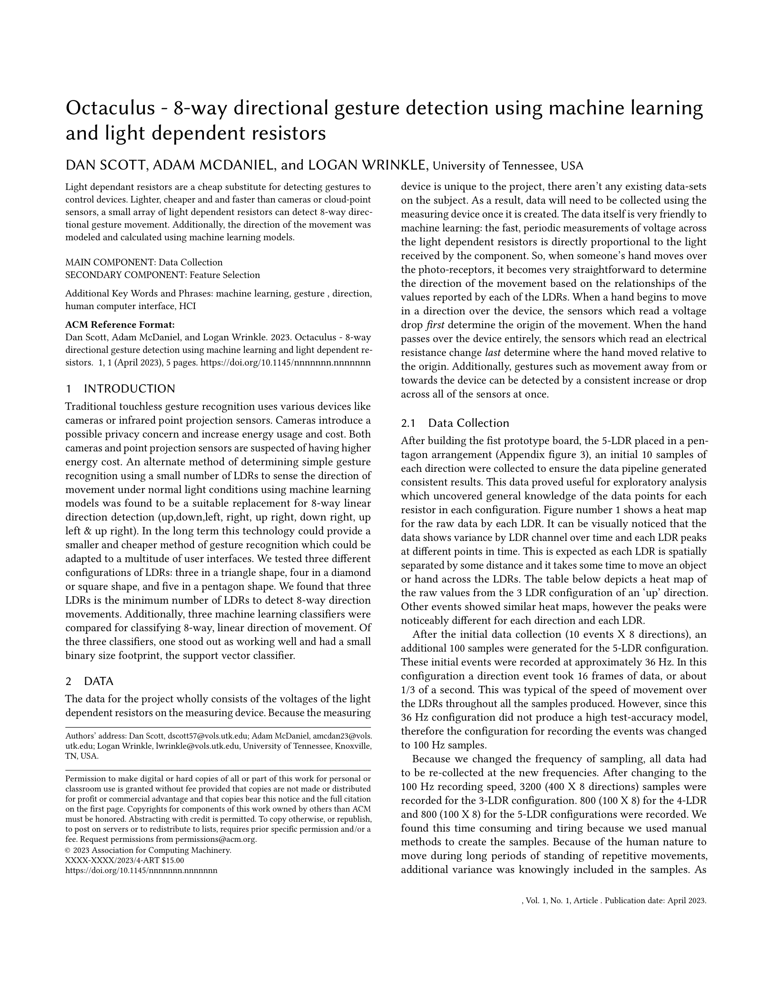
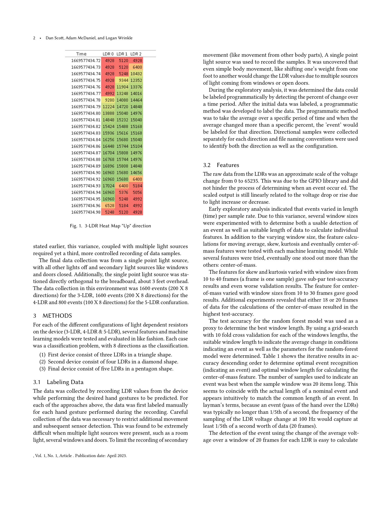
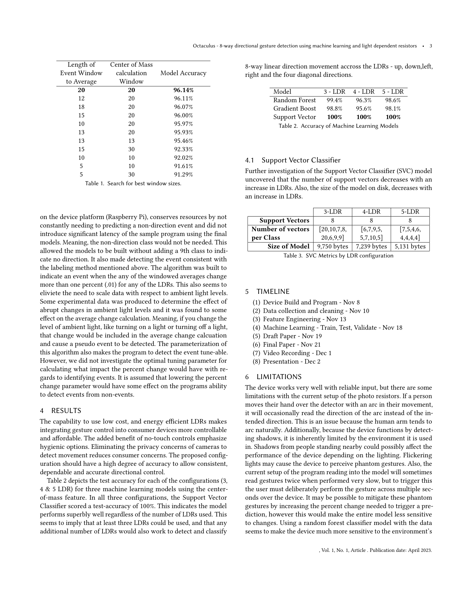
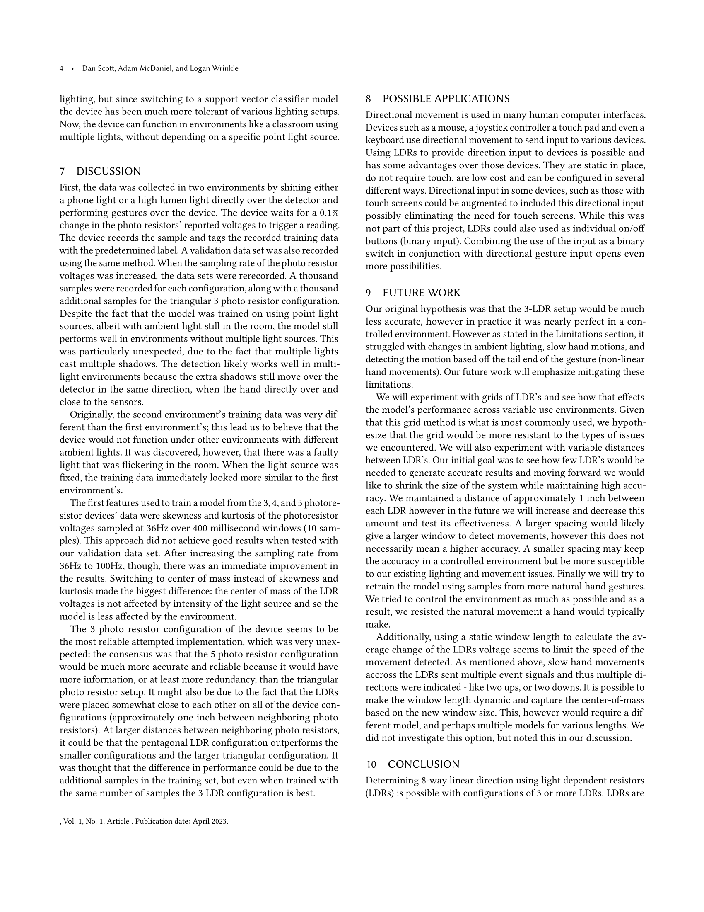
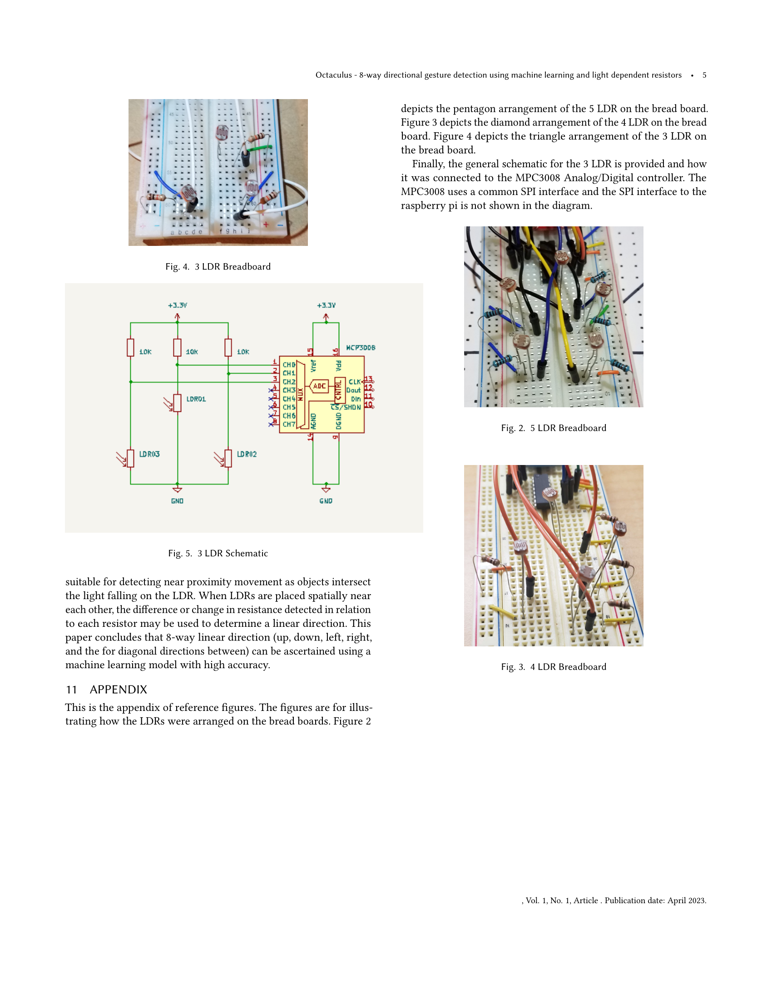

# Octaculus

This repository contains the code implementation of Octaculus, a device which uses light dependent resistors and machine learning to create a cheap yet very effective computer-human interface. The device was created by [Dan Scott](https://github.com/DD-Scott). Dan, [Logan Wrinkle](https://github.com/LagoonyToons), and I helped created the machine learning software together to interpret the outputs of the device, and produce a game called LDDR (Light Dependent/Dance Dance Revolution).

You can see a video of the demo [here](./video/Octaculus%20Demo.mp4), and a video of the how the data was captured [here](./video/Octaculus%20Data%20Capture.mp4).

